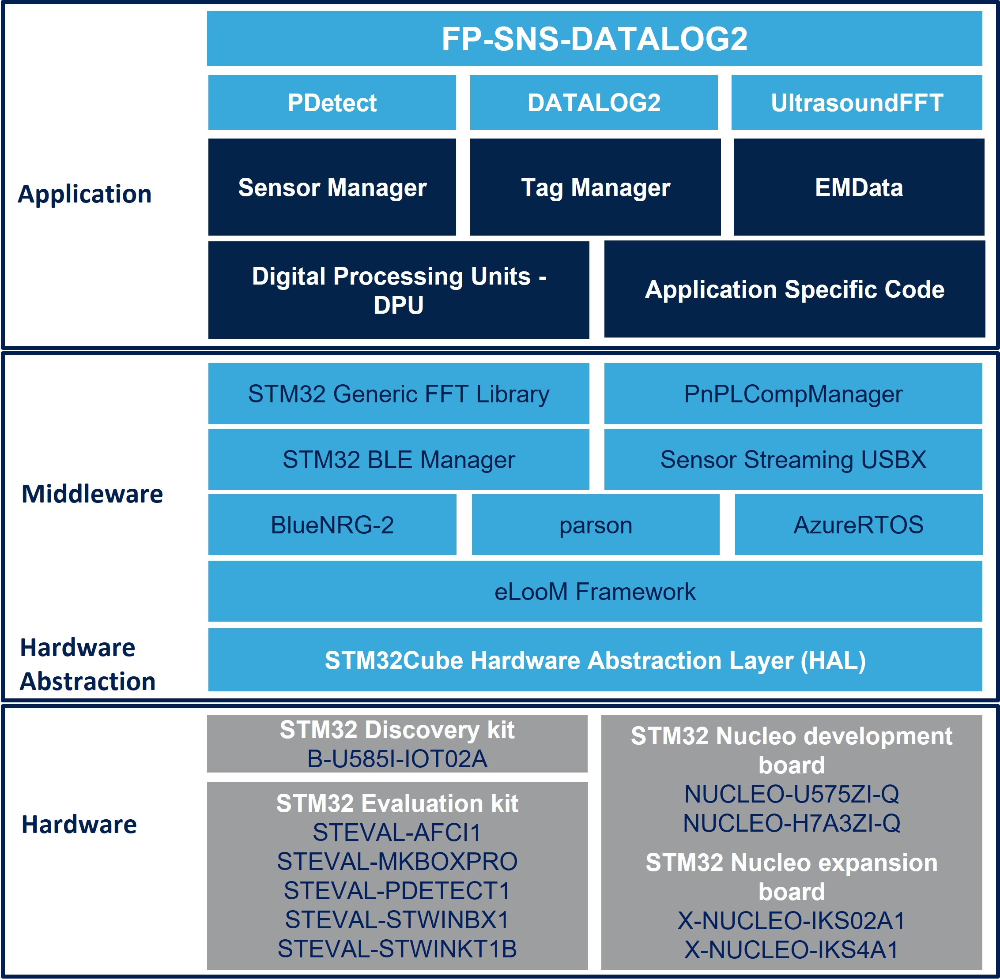

# FP-SNS-DATALOG2 Firmware Package

The **ST High Speed Datalog** (**FP-SNS-DATALOG2**) is a comprehensive multisensor
data capture and visualization toolkit, engineered to facilitate the development of
embedded data science applications.
The tool has been designed as an open and modular instrument, tailored for data
scientists and embedded designers, that streamlines the capture of wideband and
heterogeneous digital data streams from a variety of sensing and actuation platforms.
It organizes the data into structured datasets that are readily compatible with
mainstream data science toolchains, fostering reusability across multiple projects.

ST High Speed Datalog, by virtue of its data-centric design and user-friendly **Python
SDK**, may run with hardware boards that supply real-time data streams empowering
users with full control of the data acquisition process.
The included firmware is compatible with the **STBLESensor** app, which also lets you
manage the board and sensor configurations, start/stop data acquisition on SD card,
and control data labeling. Sensor data can also be streamed using a C++-based
companion host software or can be stored onto a microSD™ card.
Via the host PC and Bluetooth® Low Energy app, it is possible to configure
**ISM330BX**, **ISM330DHCX**, **LSM6DSV16BX** and **LSM6DSV16X** machine learning core unit (MLC) and the
**ISM330IS** intelligent sensor processing unit (ISPU) to read the output of the selected
algorithm.

The FP-SNS-DATALOG2 firmware can run on **STEVAL-STWINBX1**, **STEVAL-STWINKT1B**,
**STEVAL-MKBOXPRO**, **B-U585I-IOT02A**, and X-NUCLEO-IKS02A1
with **NUCLEO-U575ZI-Q** or with **NUCLEO-H7A3ZI-Q**.
ST high Speed datalog also natively supports **STEVAL-PDETECT1**, **STEVAL-C34KAT1**, **STEVAL-C34KAT2**,
**STEVAL-C34KPM1**, **STEVAL-C34DIL24** and **STEVAL-MKI230KA** add-ons for the STEVAL-STWINBX1.

The **ST High Speed Datalog** is part of the **ST Edge AI suite**, which is an integrated collection of software tools,
designed to facilitate the development and deployment of embedded AI applications.
This comprehensive suite supports both optimization and deployment of machine learning algorithms and neural
network models, starting from data collection to final deployment on hardware, streamlining the workflow for
professionals across various disciplines.
The ST Edge AI suite supports various ST products: STM32 microcontrollers and microprocessors, Stellar
microcontrollers and MEMS smart sensors.
The ST Edge AI suite represents a strategic move to democratize edge AI technology, making it a pivotal
resource for developers looking to harness the power of AI in embedded systems efficiently and effectively.

Here is the list of references to user documents:

- [DB4865](https://www.st.com/resource/en/data_brief/fp-sns-datalog2.pdf) : STM32Cube function pack for high speed datalogging and ultrasound processing
- [UM3106](https://www.st.com/resource/en/user_manual/um3106-getting-started-with-the-stm32cube-function-pack-for-the-stevalstwinbx1-evaluation-kit-for-high-speed-datalogging-and-ultrasound-processing-stmicroelectronics.pdf) : Getting started with the STM32Cube function pack for high speed datalogging and ultrasound processing
- [Doxygen](https://htmlpreview.github.io/?https://github.com/STMicroelectronics/fp-sns-datalog2/tree/main/Documentation/html/index.html): Doxygen documentation
- [STM32Cube](https://www.st.com/stm32cube): STM32Cube

## Known Limitations

- To run properly DATALOG2 example on STWIN.box, before using those applications, WIFI module firwmare must be upgraded. The binary is available in Utilities/WiFi_module_upgrade folder.
- The application has been tested with the following SD cards, formatted FAT32 with 32 KB allocation table:
  - SanDisk 32 GB Ultra HC C10 U1 A1 (p/n SDSQUA4-032G-GN6MA)
  - Verbatim 16 GB Class 10 U1 (p/n 44082)
  - Transcend Premium 16 GB U1 C10 (TS16GUSDCU1)
  - Kingston 8 GB HC C4 (SDC4/8 GB)
  For further details, please refer to [UM3106](https://www.st.com/resource/en/user_manual/um3106-getting-started-with-the-stm32cube-function-pack-for-the-stevalstwinbx1-evaluation-kit-for-high-speed-datalogging-and-ultrasound-processing-stmicroelectronics.pdf)

## Development Toolchains and Compilers

-   IAR Embedded Workbench for ARM (EWARM) toolchain V9.20.1
-   RealView Microcontroller Development Kit (MDK-ARM) toolchain V5.38
-   STM32CubeIDE v1.15.1

## Supported Devices and Boards

- [STEVAL-STWINBX1](https://www.st.com/stwinbox)
- [STEVAL-STWINKT1B](https://www.st.com/stwin)
- [STEVAL-MKBOXPRO](https://www.st.com/sensortileboxpro)
- [STEVAL-PDETECT1](https://www.st.com/en/evaluation-tools/steval-pdetect1.html)
- [STEVAL-C34KAT1](https://www.st.com/en/evaluation-tools/steval-c34kat1.html)
- [STEVAL-C34KAT2](https://www.st.com/en/evaluation-tools/steval-c34kat2.html)
- [STEVAL-C34KPM1](https://www.st.com/en/evaluation-tools/steval-c34kpm1.html)
- [B-U585I-IOT02A](https://www.st.com/en/evaluation-tools/b-u585i-iot02a.html)
- [X-NUCLEO-IKS02A1](https://www.st.com/en/ecosystems/x-nucleo-iks02a1.html) with [NUCLEO-U575ZI-Q](https://www.st.com/en/evaluation-tools/nucleo-u575zi-q.html)
- [X-NUCLEO-IKS02A1](https://www.st.com/en/ecosystems/x-nucleo-iks02a1.html) with [NUCLEO-H7A3ZI-Q](https://www.st.com/en/evaluation-tools/nucleo-h7a3zi-q.html)

## Backward Compatibility

- None

## Dependencies

- None
