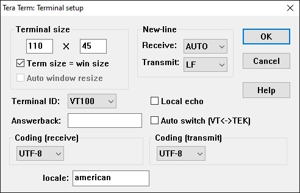
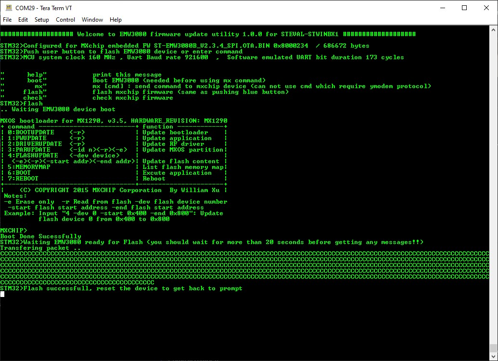

# STWIN.box Wi-Fi Module FW Upgrade - EMW3080

- Power on STWIN.box board
- Connect the STLINK both to the board and to the PC
- Open TeraTerm on STLINK COM Port: 115200 - AUTO/LF

- Drag and drop the hex file to the STLINK (or flash it with STM32CubeProgrammer)
- Push the user button to Flash the WiFi module (or write the command "flash" on the terminal)

